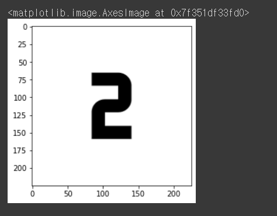
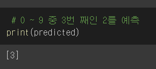

# CNN
Inference new image of CNN

## Requirements
* tensorflow 2.x
* python 3.x


## Core code
```python
1.img = cv2.imread("/content/image.png", cv2.2/IMREAD_GRAYSCALE)

2.img = cv2.resize(255-img, (28, 28)) 

3.img = img.flatten() / 255.0

4.img = img.reshape((-1, 28, 28, 1))
```


## Issue

* [X] 컬러 이미지를 흑백으로 변환하지 못하는 문제
* [X] batch 차원을 추가하지 못하는 문제
* [X] 이미지 resize와 reshape의 어려움


<!--
## Training details (epoch < 200)
### accuracy


### loss

-->

## Results
### input_img


### output_predict



## Author
SangBeom-Hahn
