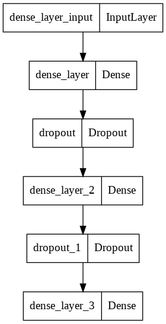
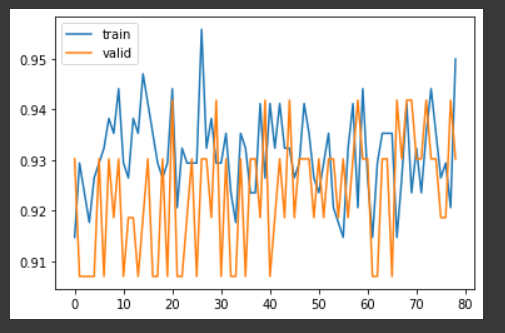
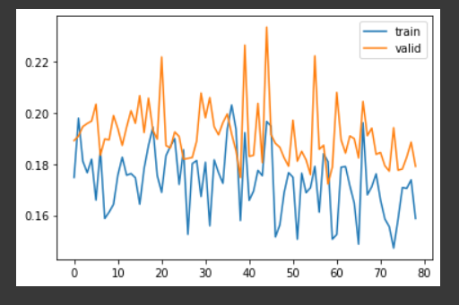
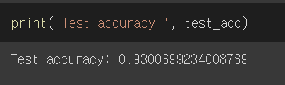
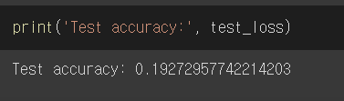

# DNN
Tensorflow implementation of DNN

## Requirements
* tensorflow 2.x
* python 3.x

## Core code
```python
model = tf.keras.models.Sequential()
model.add(keras.layers.Dense(N_HIDDEN,
   		input_shape=(RESHAPED,),
   		name='dense_layer', activation='relu'))
model.add(keras.layers.Dropout(DROPOUT))

model.add(keras.layers.Dense(N_HIDDEN,
   		name='dense_layer_2', activation='relu'))
model.add(keras.layers.Dropout(DROPOUT))

model.add(keras.layers.Dense(NB_CLASSES,
   		name='dense_layer_3', activation='sigmoid'))
```


## Model



## Training details (epoch < 200)
### accuracy


### loss



## Results
### test_accuracy


### test_loss



## Author
SangBeom-Hahn
