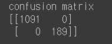
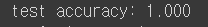

# RNN
Sentiment Analysis of RNN

## Requirements
* tensorflow 2.x
* python 3.x


## Core code
```python
class SpamClassifierModel(tf.keras.Model):
    def __init__(self, vocab_sz, embed_sz, input_length,
            num_filters, kernel_sz, output_sz, 
            run_mode, embedding_weights, 
            **kwargs):
        super(SpamClassifierModel, self).__init__(**kwargs)

        if run_mode == "scratch":
            self.embedding = tf.keras.layers.Embedding(vocab_sz, 
                embed_sz, # 입력 seq를 이 사이즈의 벡터로 변환됨
                input_length=input_length,
                trainable=True)
        elif run_mode == "vectorizer":
            self.embedding = tf.keras.layers.Embedding(vocab_sz, 
                embed_sz,
                input_length=input_length,
                weights=[embedding_weights], 
                trainable=False)
        else:
            self.embedding = tf.keras.layers.Embedding(vocab_sz, 
                embed_sz,
                input_length=input_length,
                weights=[embedding_weights],
                trainable=True)
            
        self.dropout = tf.keras.layers.SpatialDropout1D(0.2)
        self.conv = tf.keras.layers.Conv1D(filters=num_filters,
            kernel_size=kernel_sz,
            activation="relu")
        self.pool = tf.keras.layers.GlobalMaxPooling1D()
        self.dense = tf.keras.layers.Dense(output_sz, # num_classes = 2
            activation="softmax"
        )
```

<!--
## Training details (epoch < 200)
### accuracy


### loss

-->

## Results
### confusion matrix



### test_acc



## Author
SangBeom-Hahn
