# CGAN
Tensorflow implementation of CGAN

## Requirements
* tensorflow 2.x
* python 3.x

## Core code
```python

# 생성자 선언
def build_cgan_generator(z_dim):

    # 랜덤 잡음 벡터 z
    z = Input(shape=(z_dim, )) 

    # 조건 레이블: 정수 0-9까지 생성자가 만들 숫자
    label = Input(shape=(1, ), dtype='int32') 
    
    ㆍㆍㆍㆍㆍ
    
    # 벡터 z와 레이블 임베딩의 원소별 곱셈
    joined_representation = Multiply()([z, label_embedding])

    generator = build_generator(z_dim)

    # 주어진 레이블에 대한 이미지 생성
    conditioned_img = generator(joined_representation) 

    return Model([z, label], conditioned_img)
    
    
# 판별자 선언
def build_cgan_discriminator(img_shape):

    # 입력 이미지
    img = Input(shape=img_shape)

    # 입력 이미지의 레이블
    label = Input(shape=(1, ), dtype='int32')
    
    
    ㆍㆍㆍㆍㆍ
    
    # 이미지와 레이블 임베딩을 연결
    concatenated = Concatenate(axis=-1)([img, label_embedding])

    discriminator = build_discriminator(img_shape)

    # 이미지-레이블 쌍을 분류
    classification = discriminator(concatenated)

    return Model([img, label], classification) # start가 이 두개, end가 classify
    
```


## Generator
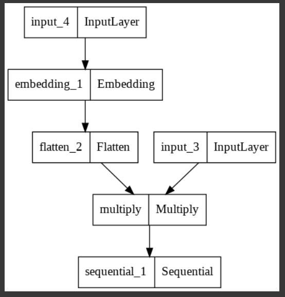


## Disciminator
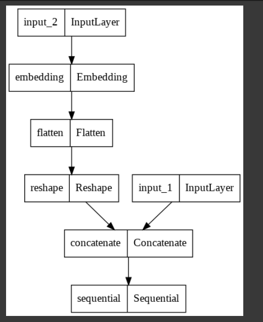


## Results
### label_zero
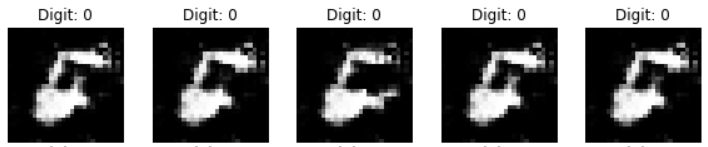

### label_one
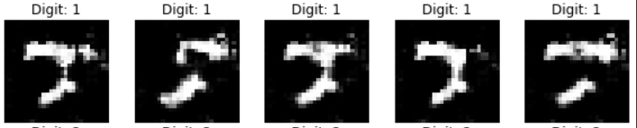

### label_two
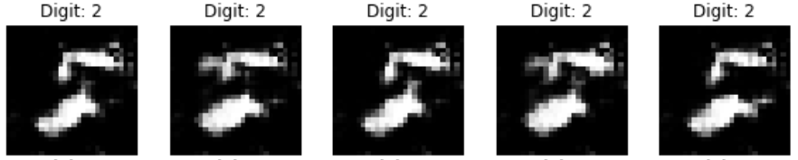

### label_three
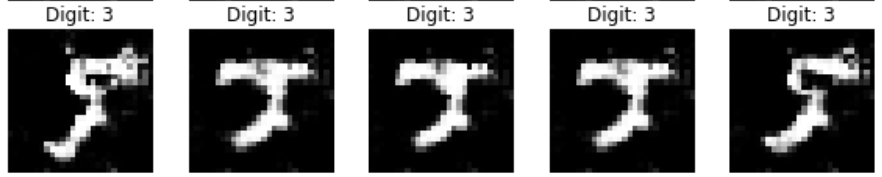

### label_four
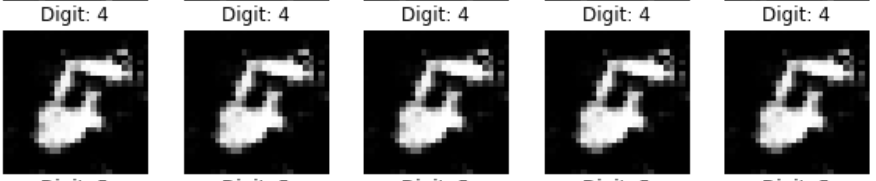

### label_five
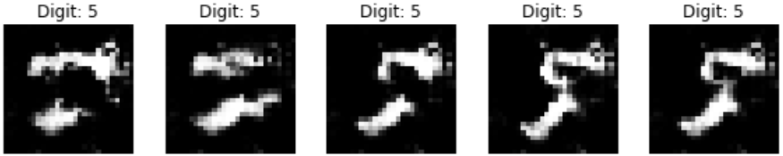

### label_six
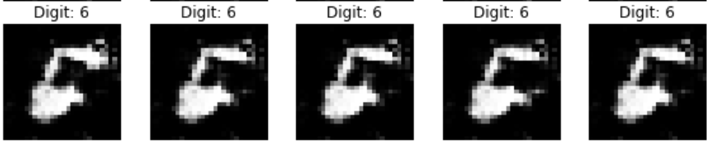

### label_seven
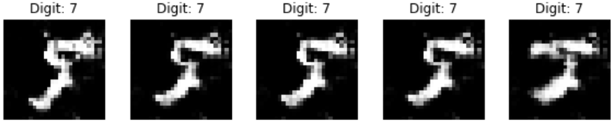

### label_eight
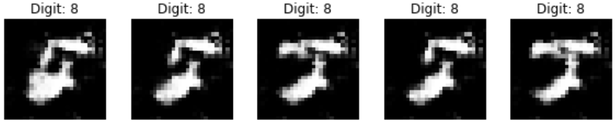

### label_nine
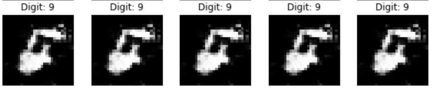


## Author

👤 **SangBoem-Hahn**

- Github: [@SangBoem-Hahn](https://github.com/SangBeom-Hahn)
- Blog : [Tistory(CGAN)](https://hsb422.tistory.com/entry/220926-GAN-PARTCGAN-CycleGAN)
---
